# Creating Active Directory Users with PowerShell

## Project overview

In this lab, I build on **Part 2 — Deploying Active Directory in Azure** by using PowerShell to create multiple test user accounts. I also configure `client-1` to allow Remote Desktop access for non-administrative domain users.

Creating accounts in bulk provides a larger sample employee environment for practicing permissions, Group Policy, account lockouts, and other Active Directory tasks later in the series.

**Scope:** This walkthrough covers Remote Desktop permissions, running an existing account creation script, and verifying the resulting accounts in Active Directory. It ends with a sign-in test to perform using one of the new users.

## Lab environment

| Component | Name or configuration | Purpose |
| --- | --- | --- |
| Domain controller | `dc-1` | Runs Active Directory and the account creation script |
| Client workstation | `client-1` | Used to test Remote Desktop access |
| Domain | `mydomain.com` | Contains the lab users and computers |
| Administrator account | `jane_admin` | Configures access and creates users |
| Employee organizational unit | `_EMPLOYEES` | Stores the generated user accounts |
| Script editor | Windows PowerShell ISE | Opens, edits, and runs the script |

## Before you begin

Complete the previous parts of the lab and confirm that:

- `dc-1` is a domain controller for `mydomain.com`.
- `client-1` is joined to the domain and uses `dc-1` for DNS.
- `jane_admin` belongs to the **Domain Admins** group.
- An organizational unit named `_EMPLOYEES` exists directly under the domain.

**OU naming matters:** The referenced script targets `_EMPLOYEES` at the domain root. If you use another name or location, update the script's destination path to match. An OU is a directory container, not a filesystem folder.

## 1. Allow domain users to access client-1 through Remote Desktop

First, configure the client so that the test accounts can connect without being administrators.

1. Connect to `client-1` using the domain administrator account:

   ```text
   mydomain.com\jane_admin
   ```

2. Open **Settings → System → Remote Desktop**.
3. Confirm that Remote Desktop is enabled.
4. Select **Select users that can remotely access this PC**.
5. In **Remote Desktop Users**, select **Add**.
6. Enter `Domain Users` and select **Check Names**.
7. Confirm that the name resolves to the domain group, then select **OK**.
8. Confirm that **Domain Users** appears in the allowed users list and save the change.

This grants the group Remote Desktop access on `client-1`; it does not make its members administrators. Sign-in remains subject to account status and applicable policies.

**Lab configuration:** This exercise grants access broadly to Domain Users. In an organization, limit access to the users or groups that need it.

<details>
<summary>View Remote Desktop configuration screenshots</summary>

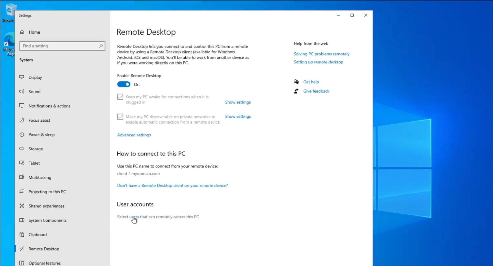

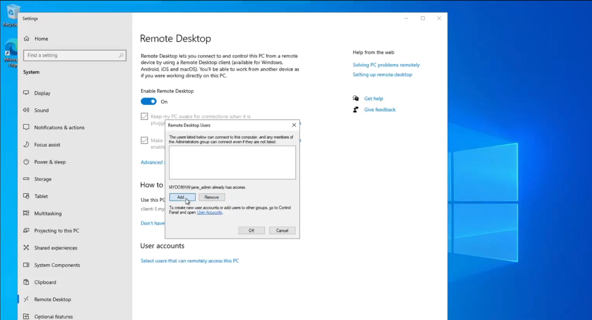

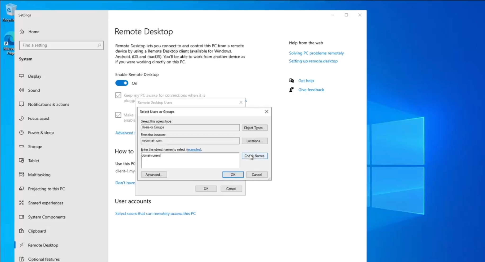

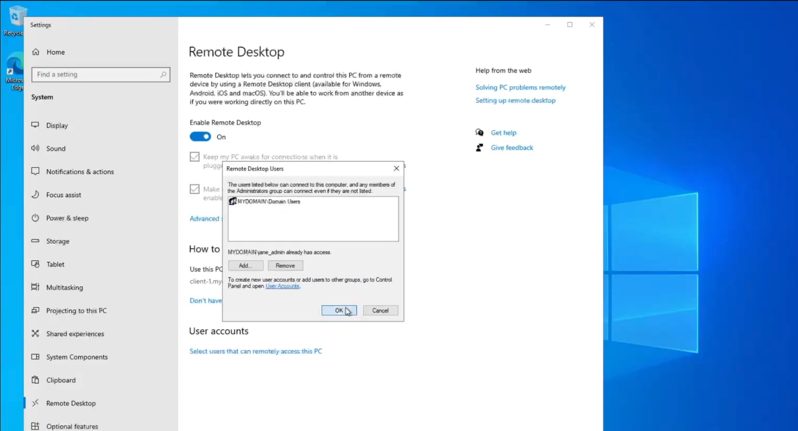

</details>

## 2. Open PowerShell ISE on dc-1

Run the account creation script on the domain controller using the domain administrator account.

1. Connect to `dc-1` as:

   ```text
   mydomain.com\jane_admin
   ```

2. Search for **Windows PowerShell ISE** in the Start menu.
3. Right-click it and select **Run as administrator**.
4. Create a new script using **File → New**.
5. Save it to the desktop as `create-users.ps1`.

The `.ps1` extension identifies the file as a PowerShell script.

<details>
<summary>View PowerShell ISE setup screenshots</summary>

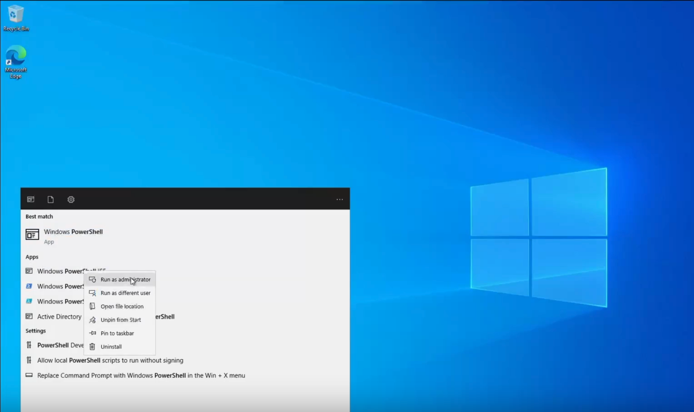

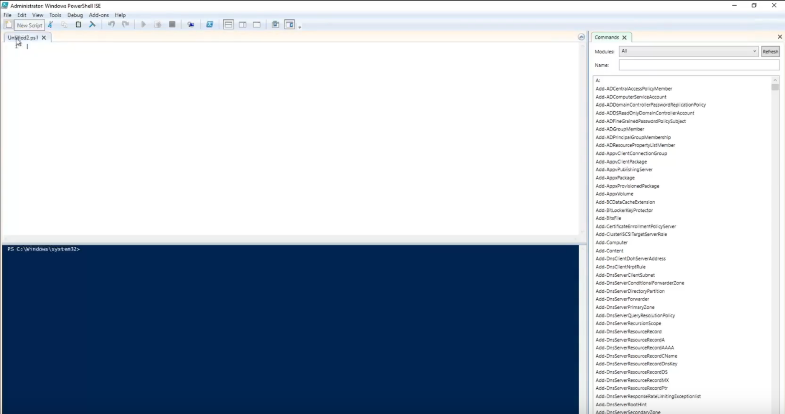

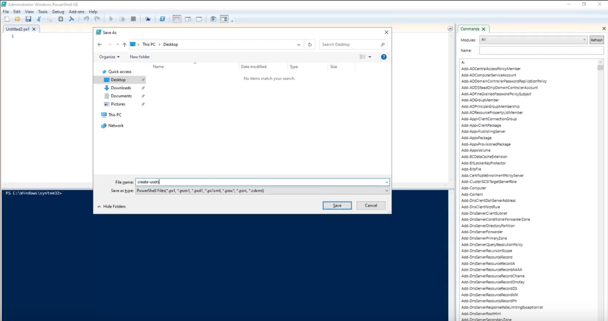

</details>

## 3. Copy and review the account creation script

This lab uses an existing script from Josh Madakor's `AD_PS` repository:

[Generate-Names-Create-Users.ps1 — original script](https://github.com/joshmadakor1/AD_PS/blob/master/Generate-Names-Create-Users.ps1)

1. Open the script using the link above.
2. Select **Raw** or **Copy raw file** to copy the script contents.
3. Paste the contents into `create-users.ps1` in PowerShell ISE.
4. Review the password setting, account creation loop, and destination OU before running it.
5. Save the file.

### Settings to review

| Setting | Purpose |
| --- | --- |
| `$PASSWORD_FOR_USERS` | Sets the shared password used for the generated lab accounts |
| `$NUMBER_OF_ACCOUNTS_TO_CREATE` | Controls the account creation loop |
| `-Path` | Specifies the destination OU for the users |

The original script uses `Password1` as the shared test password. If you change it, use the updated value when testing sign-in. This shared-password setup is for disposable lab accounts only.

**Script review notes:** The linked version starts its counter at `1` and loops while the counter is less than the configured value, so it attempts one fewer account than that value. It also assigns `$fisrtName` but later uses `$firstName` for `-GivenName`; correct the assignment to `$firstName` before running it. The script enables the accounts and sets their passwords never to expire. These details come from the [original script](https://github.com/joshmadakor1/AD_PS/blob/master/Generate-Names-Create-Users.ps1).

<details>
<summary>View script source and editor screenshots</summary>

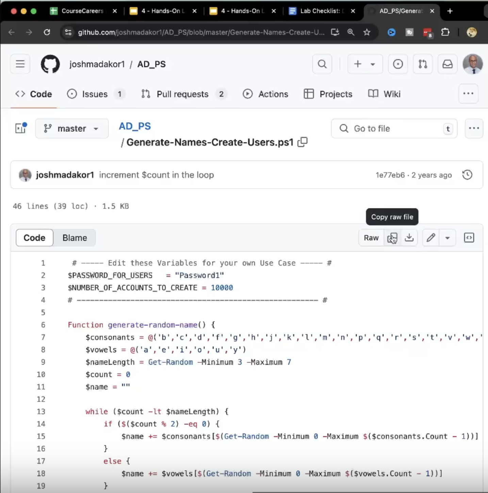

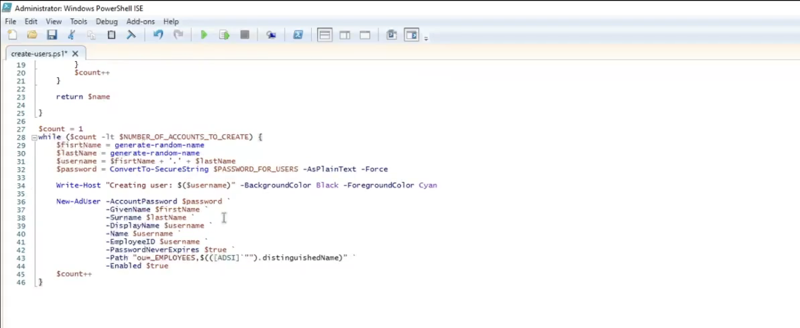

</details>

## 4. Run the script

1. In PowerShell ISE, select **Run Script** or press **F5**.
2. Watch the console as the script creates the accounts.
3. Wait for execution to finish.
4. Check for errors before moving on to verification.

The console displays account creation messages. Verify the resulting accounts in Active Directory as well; console messages alone do not confirm that every account was created successfully.

<details>
<summary>View script execution screenshots</summary>

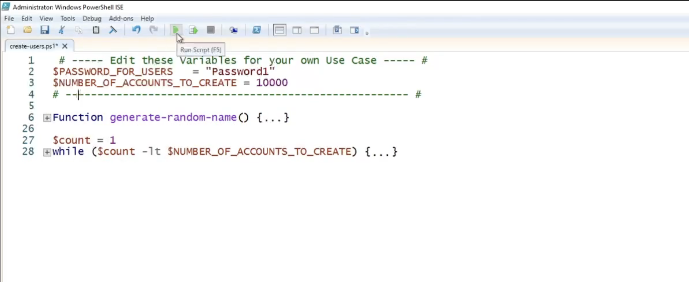

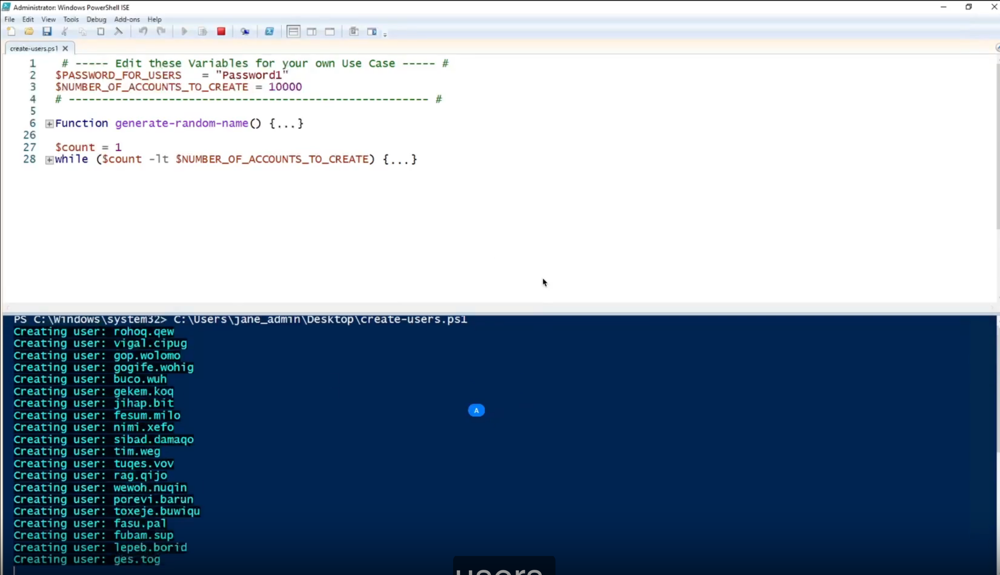

</details>

## 5. Verify the users in Active Directory

1. On `dc-1`, open **Active Directory Users and Computers (ADUC)**.
2. Expand `mydomain.com`.
3. Open `_EMPLOYEES`.
4. Refresh the view if needed.
5. Confirm that the generated user accounts appear in the OU.
6. Select one account and record its user logon name for the next step.

The screenshots below show the OU being refreshed and populated with generated accounts.

<details>
<summary>View account verification screenshots</summary>

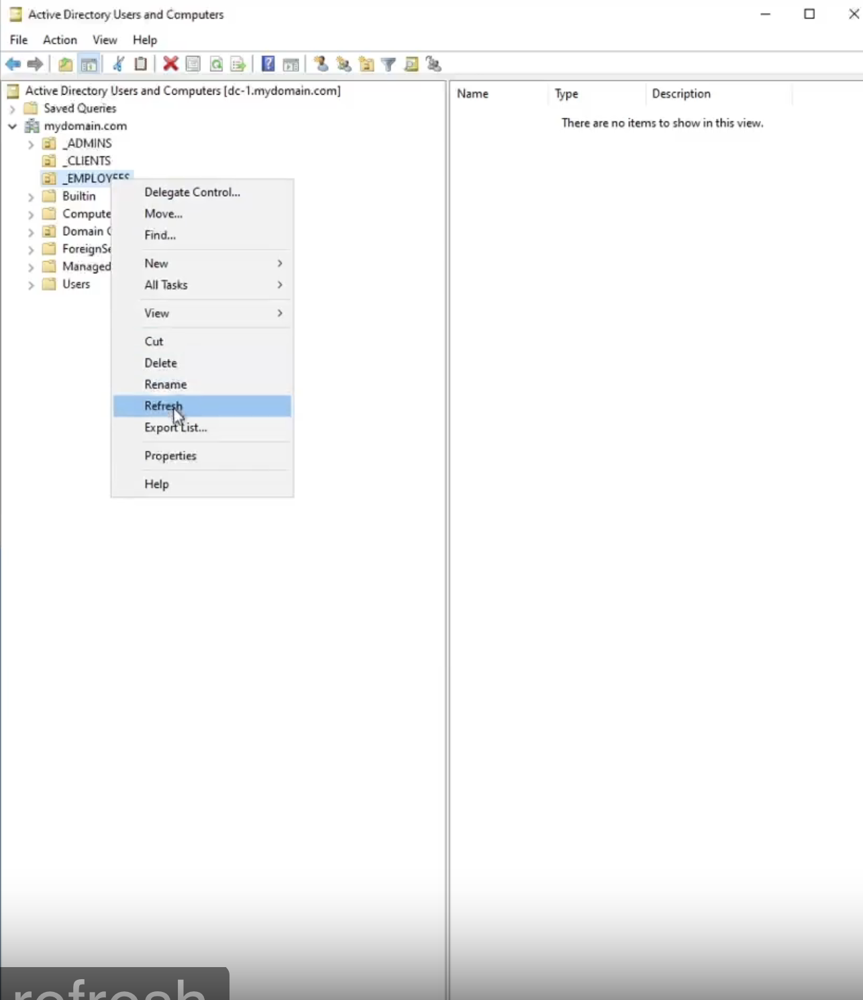

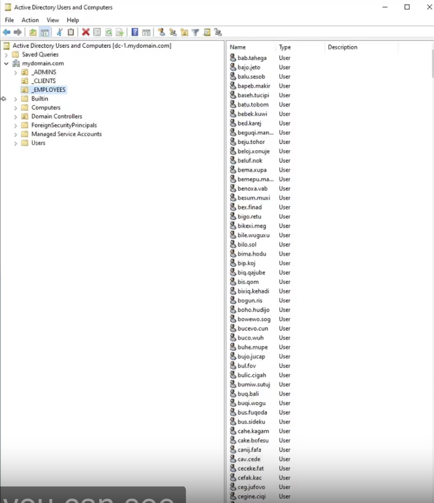

</details>

## 6. Test Remote Desktop sign-in with a standard user

Use one of the generated accounts to test the access configured earlier.

1. Sign out of the administrator session on `client-1`.
2. Start a new Remote Desktop connection to `client-1`.
3. Enter the selected account using this format, replacing `<generated-username>` with its actual logon name:

   ```text
   mydomain.com\<generated-username>
   ```

4. Enter the password configured in the script.
5. Confirm that the user's Windows desktop opens.

**Expected result:** The selected domain user can connect to `client-1` through Remote Desktop without being added to an administrator group.

This is the final validation step. The screenshots in this walkthrough show account creation and OU verification; they do not show the completed user sign-in.

## Results

The walkthrough documents:

- Adding **Domain Users** to the allowed Remote Desktop users on `client-1`.
- Preparing and running an account creation script in PowerShell ISE on `dc-1`.
- Verifying generated accounts in the `_EMPLOYEES` OU.

The standard-user Remote Desktop test above completes the validation of the configuration.

## Skills practiced

- Configuring Remote Desktop access for non-administrative domain users.
- Working with group-based access permissions.
- Reviewing and running a PowerShell script with administrator privileges.
- Creating Active Directory user accounts in bulk.
- Verifying user objects in Active Directory Users and Computers.

## Next steps

Use the test accounts to practice file permissions, Group Policy, password resets, and account lockouts. Capture the successful standard-user Remote Desktop sign-in to complete the evidence for this part of the portfolio.

## Script credit

The account creation script is from [Josh Madakor's AD_PS repository](https://github.com/joshmadakor1/AD_PS/blob/master/Generate-Names-Create-Users.ps1). This project documents its use in the lab.
